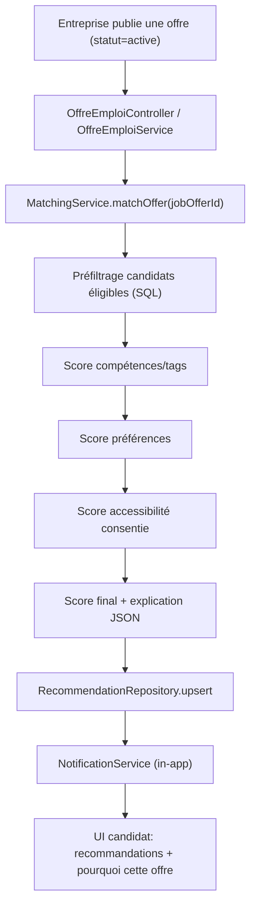

# Rapport Technique - Système de Matching Offres/Candidats HandiTalents (basé sur l'existant)

Date du rapport: 7 mai 2026  
Périmètre audité:
- Frontend: `C:\Users\nourr\Downloads\handi-main\handi_front-master`
- Backend: `C:\Users\nourr\Downloads\handi-main\handi_talents-main`

---

## 1) Résumé exécutif

L'approche hybride que tu proposes (tags structurés + score explicable + embeddings) est pertinente pour HandiTalents, mais elle doit être mise en œuvre en continuité avec l'architecture existante.

Constat clé:
- Le socle métier actuel est solide (offres, candidatures, entretiens, notifications in-app).
- Le backend actuel est Express + TypeScript + Drizzle + PostgreSQL (pas Prisma).
- Il n'existe pas encore de moteur de recommandation, d'embeddings, de pgvector, de workers BullMQ/Redis.
- Les données handicap sont déjà fortement présentes dans le modèle candidat et certaines sont obligatoires à l'inscription; ce point doit être corrigé avant toute automatisation de matching.

Recommandation globale:
1. V1: matching explicable par règles + tags, sans IA vectorielle.
2. V2: embeddings + pgvector.
3. V3: orchestration asynchrone Redis/BullMQ et optimisation du ranking.

---

## 2) Objectif produit visé

Quand une offre est publiée, HandiTalents doit:
1. Identifier automatiquement des candidats compatibles.
2. Créer des recommandations traçables et explicables.
3. Notifier les candidats concernés (in-app en priorité).
4. Respecter le consentement et la confidentialité des données d'accessibilité/handicap.

---

## 3) État réel de l'application (audit technique)

### 3.1 Stack actuelle réellement en place

Frontend:
- Next.js 16 + React 19 + TypeScript
- Routes front déjà riches (offres, candidatures, entretiens, favoris, profil, tests)
- Endpoints Next API locaux existants pour `chatbot` et `job-summary` via Ollama

Backend:
- Express 5 + TypeScript
- Drizzle ORM + PostgreSQL
- Auth JWT
- Uploads via Multer
- Notifications in-app persistées en base

Asynchrone / IA:
- Pas de BullMQ / Redis en production actuelle
- Pas de pgvector
- Pas de service embeddings en backend

### 3.2 Modules métier déjà opérationnels

Disponibles:
- Offres emploi (création, modification, statut, listing)
- Candidatures (postuler, shortlist/refuser/accepter, statistiques)
- Entretiens (planifier/modifier/confirmer/annuler/terminer)
- Favoris
- Notifications in-app
- Profils candidat/entreprise

Non disponibles:
- Recommandations candidates à partir d'offres
- Matching automatique déclenché à la publication
- Explication formelle de matching stockée en base
- Préférences notifications de recommandations (immédiat/quotidien/hebdo)

### 3.3 Schéma de données existant pertinent pour le matching

Données utiles déjà présentes:
- `offre_emploi`: `titre`, `description`, `localisation`, `type_poste`, `competences_requises`, `experience_requise`, `accessibilite_handicap`, `amenagements_possibles`, `statut`
- `candidat`: `competences` (JSON), `experience`, `disponibilite`, `preferences_accessibilite` (JSON), `cv_url`
- `candidature`: `statut`, `score_test`, `date_postulation`
- `notification`: in-app persisté

Point sensible actuel:
- `candidat` contient `type_handicap`, `num_carte_handicap`, etc. (sensible), avec contrainte forte dans le flux d'inscription.

---

## 4) Écart entre la cible souhaitée et l'existant

### 4.1 Écart architecture

Cible théorique initiale:
- Prisma + pgvector + BullMQ + Redis

Existant:
- Drizzle + PostgreSQL standard + traitements synchrones

Décision:
- Conserver Drizzle et introduire progressivement:
  - d'abord moteur de scoring métier (sync ou async léger),
  - puis pgvector,
  - puis BullMQ/Redis si charge réelle.

### 4.2 Écart fonctionnel

À construire:
- Table de recommandations
- Endpoint candidat "offres recommandées"
- Service de calcul score multi-composantes
- Trigger sur publication offre
- Explication du score consommable par UI

### 4.3 Écart conformité / données sensibles

À corriger rapidement:
- Dissocier "handicap administratif/médical" et "préférences d'aménagement"
- Ajouter consentement explicite pour usage en matching
- Interdire l'usage des champs médicaux dans embeddings/scoring

---

## 5) Architecture cible recommandée (adaptée au code actuel)



Version V2 (optionnelle):
- insertion d'un composant `EmbeddingProvider` + `pgvector` entre D et H.

---

## 6) Modèle de données recommandé (delta minimal Drizzle)

### 6.1 Nouvelles tables (V1)

1. `recommendation`
- `id`
- `id_candidat`
- `id_offre`
- `score_final` (float)
- `score_skills` (float)
- `score_preferences` (float)
- `score_accessibility` (float)
- `score_semantic` (nullable en V1)
- `explanation_json` (jsonb)
- `status` (`pending|notified|viewed|applied|dismissed`)
- `created_at`, `updated_at`
- contrainte unique (`id_candidat`, `id_offre`)

2. `candidate_matching_consent`
- `id_candidat` (PK/FK)
- `allow_accessibility_matching` (bool)
- `allow_semantic_profile_embedding` (bool)
- `updated_at`

### 6.2 Extensions V2 (embeddings)

Table SQL manuelle (compatible Drizzle):
```sql
CREATE EXTENSION IF NOT EXISTS vector;

CREATE TABLE candidate_embeddings (
  candidate_id UUID PRIMARY KEY,
  embedding vector(1536),
  source_hash TEXT NOT NULL,
  updated_at TIMESTAMP DEFAULT NOW()
);

CREATE TABLE job_offer_embeddings (
  job_offer_id UUID PRIMARY KEY,
  embedding vector(1536),
  source_hash TEXT NOT NULL,
  updated_at TIMESTAMP DEFAULT NOW()
);

CREATE INDEX candidate_embeddings_vector_idx
ON candidate_embeddings USING ivfflat (embedding vector_cosine_ops);

CREATE INDEX job_offer_embeddings_vector_idx
ON job_offer_embeddings USING ivfflat (embedding vector_cosine_ops);
```

---

## 7) Algorithme de matching recommandé (progressif)

### 7.1 V1 (sans embeddings)

Étape A - Préfiltres (obligatoires)
- Offre `statut = active`
- Candidat actif/disponible
- Contrat compatible
- Localisation compatible (ou remote)
- Exclure candidatures déjà rejetées/acceptées sur l'offre

Étape B - Score compétences
- Parser `competences_requises` offre
- Normaliser (alias: `react.js` -> `react`, etc.)
- Comparer à `candidat.competences` JSON

Étape C - Score préférences
- Contrat
- Remote / présence
- Localisation

Étape D - Score accessibilité consentie
- Utiliser uniquement `preferences_accessibilite` et champs offre d'aménagement
- Zéro usage de `type_handicap`, `num_carte_handicap`, etc.

Étape E - Score final V1
```txt
score_final =
  skill_score * 0.50 +
  preference_score * 0.30 +
  accessibility_score * 0.20
```

Seuils V1:
- `>= 0.75` notification in-app immédiate
- `0.60 - 0.74` recommandation passive (sans push immédiat)

### 7.2 V2 (avec embeddings)

Ajouter:
- `semantic_score` via cosinus pgvector
- poids proposés:
```txt
score_final =
  semantic_score * 0.40 +
  skill_score * 0.30 +
  preference_score * 0.20 +
  accessibility_score * 0.10
```

---

## 8) Explication du score (indispensable produit)

Exemple `explanation_json`:
```json
{
  "matchedSkills": ["React", "TypeScript"],
  "missingSkills": ["Jest"],
  "preferenceMatches": ["CDI", "Remote"],
  "accessibilityMatches": ["Horaires flexibles"],
  "semanticReason": null
}
```

Affichage UI candidat:
- Pourquoi cette offre ?
- 2 compétences clés trouvées
- Contrat et mode de travail compatibles
- Aménagements compatibles déclarés

---

## 9) API cible recommandée (compatible namespace actuel)

### 9.1 Recommandations candidat
- `GET /api/recommandations/candidat`
- `POST /api/recommandations/:id/view`
- `POST /api/recommandations/:id/dismiss`
- `POST /api/recommandations/:id/apply`

### 9.2 Publication offre / matching
- Garder route existante de changement statut:
  - `PATCH /api/entreprise/offres/:id/statut`
- Ajouter hook dans service:
  - si `statut` passe à `active`, déclencher `matchingService.matchOffer(idOffre)`

### 9.3 Consentement
- `PATCH /api/candidats/matching-consent`
- `GET /api/candidats/matching-consent`

---

## 10) Intégration dans le code actuel (points d'ancrage exacts)

### 10.1 Déclenchement matching
- Fichier: `src/controllers/offre-emploi.controller.ts`
- Méthode: `changerStatutOffre`
- Action: appeler `matchingService.matchOffer(idOffre)` après passage à `active`

### 10.2 Persistence recommandation
- Créer:
  - `src/db/schema/recommendation.schema.ts`
  - `src/repositories/recommendation.repository.ts`
  - `src/services/matching.service.ts`
  - `src/services/recommendation.service.ts`
  - `src/routes/recommandation.routes.ts`
  - `src/controllers/recommandation.controller.ts`

### 10.3 Notification réutilisée
- Réutiliser `NotificationService.creerNotification` existant
- Type recommandé à ajouter: `job_recommendation`

### 10.4 Lien candidature -> recommandation
- Dans `CandidatureService.postuler`, si offre issue d'une reco:
  - marquer recommandation en `APPLIED`

---

## 11) Gouvernance des données sensibles (spécifique HandiTalents)

Principes imposés:
1. Aucune donnée handicap médicale dans embeddings.
2. Aucune décision automatique d'exclusion basée handicap.
3. Usage accessibilité uniquement sur données volontaires + consentement explicite.
4. Masquage côté entreprise par défaut (pas d'exposition du besoin détaillé sans accord).
5. Journalisation des accès aux champs sensibles.

Action correctrice prioritaire:
- Réviser le flux d'inscription candidat pour rendre les données handicap administratives non bloquantes pour le matching métier, et déplacer le matching vers préférences d'aménagement consenties.

---

## 12) Plan de mise en œuvre recommandé

### Phase 0 (1 sprint) - conformité et base propre
- Ajouter consentement matching
- Définir taxonomie compétences + alias
- Clarifier séparation "admin handicap" vs "préférences travail"

### Phase 1 (1-2 sprints) - matching V1 explicable
- Table recommandations
- Service de scoring règles
- Trigger publication offre
- Endpoint liste recommandations candidat
- Notification in-app
- UI "Pourquoi cette offre ?"

### Phase 2 (1-2 sprints) - embeddings V2
- Tables pgvector
- Service `EmbeddingProvider`
- Génération embedding offre/candidat
- Intégration score sémantique

### Phase 3 (option scale)
- Redis + BullMQ
- Retry jobs, anti-spam, batch notif
- Monitoring avancé

---

## 13) KPI à suivre dès V1

Matching:
- nombre recommandations créées / offre publiée
- taux de recommandations vues
- taux de clic vers détails offre
- taux de candidature post-recommandation

Qualité:
- ratio recommandations rejetées rapidement
- feedback utilisateur "non pertinent"

Conformité:
- taux de consentement
- nombre accès champs sensibles

---

## 14) Risques et mitigations

Risque 1 - bruit dans les compétences texte  
Mitigation: taxonomie + alias + normalisation stricte.

Risque 2 - recommandations non pertinentes au démarrage  
Mitigation: seuils conservateurs + feedback candidat.

Risque 3 - confusion entre handicap et accessibilité  
Mitigation: séparation stricte des champs et règles d'usage.

Risque 4 - dette technique due aux routes dupliquées/hybrides  
Mitigation: rationaliser progressivement les endpoints offres.

---

## 15) Décision technique finale recommandée

Pour HandiTalents, sur la base du code réel:
- Conserver Express + TypeScript + Drizzle + PostgreSQL.
- Construire un moteur de matching V1 explicable sans attendre l'IA vectorielle.
- Ajouter pgvector/embeddings en V2 sans refondre l'existant.
- Conserver notifications in-app comme canal primaire (déjà implémenté).
- Introduire Redis/BullMQ uniquement quand les volumes le rendent nécessaire.

Cette trajectoire minimise le risque, accélère la mise en production, et respecte le contexte sensible de la plateforme.

---

## 16) Annexe - Interface d'abstraction embeddings (V2)

```ts
export interface EmbeddingProvider {
  embed(text: string): Promise<number[]>;
  dimension(): number;
}
```

Exemples d'implémentations futures:
- provider Ollama local
- provider OpenAI
- provider Cohere/Voyage

---

## 17) Livrable suivant suggéré

Prochain livrable recommandé:
- Spécification d'implémentation V1 (tables Drizzle + services + endpoints + tests) prête à coder en sprint.

